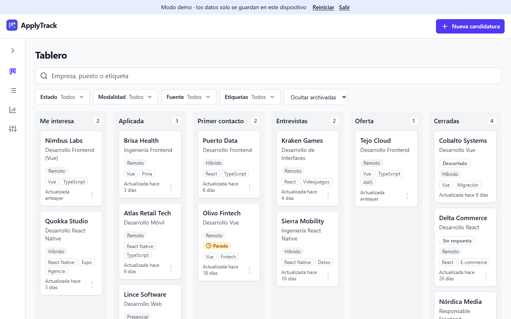
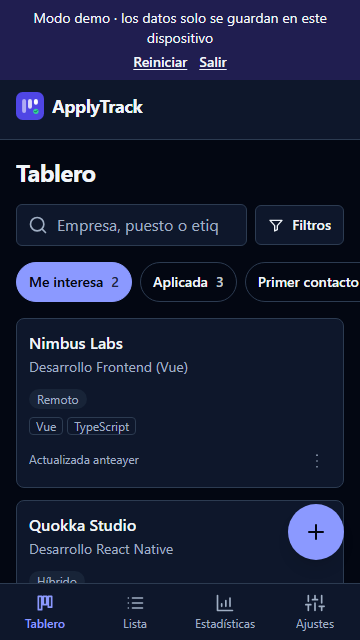
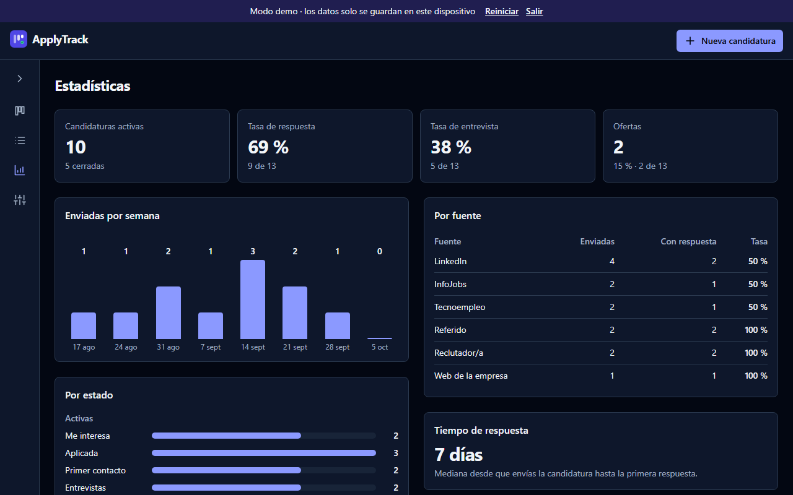
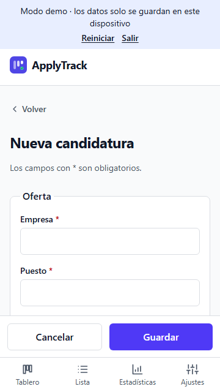

<p align="center"></p>

# ApplyTrack

[](https://github.com/srdgz/applytrack/actions/workflows/ci.yml)

Gestor de candidaturas de empleo con **web (Vue 3)** y **app móvil (React Native + Expo)** que comparten un núcleo de dominio con **arquitectura hexagonal**, escrito en TypeScript y desarrollado con **Spec-Driven Development**.

> Hitos M0 a M5 terminados: núcleo, modo demo, web, cuentas con Supabase, app móvil y calidad. Queda el despliegue de la web y el APK de Android. Ver la [hoja de ruta](docs/specs/004-hoja-de-ruta.md).

## Capturas

<p>
  
  
</p>
<p>
  
  
</p>

## Qué hace

- **Cuentas sin contraseña:** enlace mágico por email, con los datos en Supabase y Row Level Security.
- **Modo demo sin registro:** 15 candidaturas de ejemplo guardadas solo en el dispositivo.
- **Tablero** por estados, con arrastrar y soltar (ratón) y menú «Mover a…» (teclado y táctil).
- **Lista** con orden por columnas, búsqueda sin tildes y filtros (en la web, en la URL).
- **Formulario** de crear y editar con validación en vivo y las mismas reglas que el dominio.
- **Detalle** con historial de cambios de estado y solo las transiciones permitidas.
- **Estadísticas:** tasas de respuesta, entrevista y oferta, actividad semanal, efectividad por fuente y candidaturas paradas.
- **Archivar, desarchivar y eliminar.**
- **Avisos** inspirados en [Sileo](https://sileo.aaryan.design): siete tipos, promesas y «Deshacer».
- **Español e inglés**, tema claro, oscuro o del sistema (guardados en el perfil), y diseño responsive de 320 px a 2560 px.
- **La app móvil tiene las mismas funciones** que la web, con componentes nativos.

## Cómo probarlo

Requisitos: **Node 24** (mínimo 22.12, ver `.nvmrc`) y **pnpm 12**.

```bash
pnpm install
pnpm dev:web            # web en http://localhost:5173
pnpm dev:mobile         # app en Expo Go: escanea el QR
pnpm dev:mobile:tunnel  # igual, con túnel: necesario para entrar con email en Expo Go
pnpm dev:android        # app en el emulador de Android
pnpm dev:ios            # app en el simulador de iOS (solo en macOS)
```

- **Sin configurar nada,** la web y la app funcionan en **modo demo**: pulsa «Probar sin cuenta».
- **Para las cuentas,** copia `apps/web/.env.example` y `apps/mobile/.env.example` a `.env.local` en la misma carpeta, con la URL y la clave publicable de un proyecto de Supabase, y aplica las migraciones con `pnpm supabase link` y `pnpm supabase db push`. Los pasos completos están en la [spec 104](docs/specs/104-autenticacion.md#8-configuración-del-proyecto-en-supabase).
- **El emulador de Android** necesita Android Studio con un dispositivo virtual; Expo lo arranca e instala Expo Go si hace falta. El simulador de iOS solo existe en macOS.

## Arquitectura

```
apps/
  web/              Vue 3 · Vite · Tailwind CSS 4 · vue-router · vue-i18n
  mobile/           Expo · Expo Router · NativeWind · i18next
packages/
  core/             Dominio y casos de uso. Sin dependencias de runtime.
  adapter-local/    Repositorio del modo demo sobre localStorage / AsyncStorage
  adapter-supabase/ Repositorio, sesión, acceso y perfil sobre Supabase
  composition/      Raíz de composición compartida por la web y el móvil
  presentation/     Filtros, formatos y formulario compartidos por la web y el móvil
  i18n/             Catálogos ES/EN compartidos en formato ICU
  notifications/    Cola de avisos compartida por web y móvil
  design-tokens/    Colores comunes de la web y el móvil
  config/           tsconfig y ESLint compartidos
brand/              Logo en SVG; `pnpm brand` genera los iconos de la web y la app
supabase/           Migraciones SQL con RLS, configuración local y plantilla del correo
docs/
  specs/            Especificaciones con criterios de aceptación
  adr/              Decisiones de arquitectura
  screenshots/      Capturas generadas para este README
```

- **Puertos y adaptadores:** `core` define los puertos (repositorio, sesión, acceso, reloj…) y los adaptadores los implementan. Las apps solo conectan las piezas en su carpeta `di/`.
- **Reglas comprobadas en CI** con `dependency-cruiser`: el dominio no importa nada externo, `core` no usa paquetes de npm, la interfaz no importa adaptadores y no hay dependencias circulares.
- **Errores de negocio como datos:** los casos de uso devuelven `Result` con códigos de error, y la interfaz los traduce.
- **Suite de contrato:** el repositorio en memoria, el local y el de Supabase pasan los mismos tests de búsqueda, orden, paginación y aislamiento entre usuarios.

## Calidad

| Qué                  | Cómo                                                                                                                                         |
| -------------------- | -------------------------------------------------------------------------------------------------------------------------------------------- |
| Tests unitarios      | Vitest en los paquetes y la web; Jest y Testing Library en el móvil. `core` por encima del 90 % de cobertura.                                |
| Contrato y seguridad | La suite de contrato y los tests de RLS contra un Supabase local en la CI.                                                                   |
| Arquitectura         | `dependency-cruiser` en cada PR.                                                                                                             |
| E2E de la web        | Playwright en 360, 768, 1280 y 1920 px, incluido un recorrido solo con teclado y la ausencia de scroll horizontal.                           |
| Accesibilidad        | axe en las pantallas principales, en tema claro y oscuro, sin infracciones graves.                                                           |
| Rendimiento          | Lighthouse en móvil: 100 en rendimiento, accesibilidad y buenas prácticas. JavaScript inicial de 131 KB comprimido, con un límite de 200 KB. |
| E2E del móvil        | Maestro en el emulador de Android con Expo Go (`pnpm e2e:mobile`).                                                                           |
| Textos               | Paridad de claves entre idiomas y reglas de lint que impiden textos sin traducir.                                                            |

| Comando                   | Qué hace                                                   |
| ------------------------- | ---------------------------------------------------------- |
| `pnpm lint`               | ESLint en todos los paquetes                               |
| `pnpm typecheck`          | Comprobación de tipos con TypeScript                       |
| `pnpm test`               | Vitest (paquetes y web) y Jest (móvil), con cobertura      |
| `pnpm depcruise`          | Reglas de dependencia de la arquitectura hexagonal         |
| `pnpm format`             | Formatea el código con Prettier                            |
| `pnpm build`              | Compila la web                                             |
| `pnpm e2e`                | E2E y accesibilidad de la web con Playwright y axe         |
| `pnpm lighthouse`         | Presupuesto de JavaScript y Lighthouse en móvil            |
| `pnpm e2e:mobile`         | E2E del móvil con Maestro (con `pnpm dev:android` abierto) |
| `pnpm screenshots`        | Capturas de la web para este README                        |
| `pnpm screenshots:mobile` | Capturas de la app para este README                        |

La primera vez, `pnpm --filter @applytrack/web e2e:install` descarga Chromium dentro del proyecto. Maestro se instala aparte siguiendo [su guía](https://docs.maestro.dev/getting-started/installing-maestro) y necesita Java 17 o superior.

## Documentación

| Documento                                                                    | Contenido                                                  |
| ---------------------------------------------------------------------------- | ---------------------------------------------------------- |
| [000 · Producto](docs/specs/000-producto.md)                                 | Visión, alcance, modelo de dominio y requisitos            |
| [001 · Arquitectura](docs/specs/001-arquitectura.md)                         | Hexagonal, SOLID, monorepo, datos y testing                |
| [002 · i18n](docs/specs/002-i18n.md)                                         | Español e inglés: catálogos, formatos y verificación       |
| [003 · Responsive](docs/specs/003-responsive.md)                             | Breakpoints y comportamiento de cada pantalla              |
| [004 · Hoja de ruta](docs/specs/004-hoja-de-ruta.md)                         | Hitos y estado de cada especificación                      |
| [100 · Crear y editar](docs/specs/100-crear-y-editar-candidatura.md)         | Validación, casos de uso y formulario                      |
| [101 · Cambio de estado](docs/specs/101-cambio-de-estado.md)                 | Transiciones, detalle y movimientos en el tablero          |
| [102 · Tablero y lista](docs/specs/102-tablero-y-lista.md)                   | Búsqueda, filtros, orden y paginación                      |
| [103 · Modo demo](docs/specs/103-modo-demo.md)                               | Adaptador local y datos de ejemplo                         |
| [104 · Autenticación](docs/specs/104-autenticacion.md)                       | Enlace mágico, preferencias y Supabase                     |
| [105 · Estadísticas](docs/specs/105-panel-estadisticas.md)                   | Métricas y panel                                           |
| [106 · Archivar y eliminar](docs/specs/106-archivar-y-eliminar.md)           | Archivado reversible y borrado con confirmación            |
| [107 · Notificaciones](docs/specs/107-notificaciones.md)                     | Avisos compartidos web y móvil                             |
| [108 · Identidad visual](docs/specs/108-identidad-visual.md)                 | Logo, iconos y pantalla de carga                           |
| [109 · Base de la app móvil](docs/specs/109-base-app-movil.md)               | Navegación, modo demo, acceso y ajustes en el móvil        |
| [110 · Tablero y lista en el móvil](docs/specs/110-tablero-y-lista-movil.md) | Tablero, lista, búsqueda y filtros en el móvil             |
| [111 · Detalle en el móvil](docs/specs/111-detalle-movil.md)                 | Detalle, cambio de estado, archivar y eliminar en el móvil |
| [112 · Formulario en el móvil](docs/specs/112-formulario-movil.md)           | Crear y editar candidaturas en el móvil                    |
| [113 · Estadísticas en el móvil](docs/specs/113-estadisticas-movil.md)       | Panel de estadísticas en el móvil                          |
| [114 · Calidad de la web](docs/specs/114-calidad-web.md)                     | E2E, accesibilidad, rendimiento y textos sin traducir      |
| [115 · Calidad del móvil y README](docs/specs/115-calidad-movil-y-readme.md) | E2E con Maestro y capturas                                 |
| [ADR](docs/adr)                                                              | Decisiones de arquitectura                                 |

## Stack

**En uso:** TypeScript · Vue 3 · Vite · Tailwind CSS 4 · vue-router · vue-i18n · React Native · Expo · Expo Router · NativeWind · i18next · Supabase (Auth, Postgres, RLS) · Zod · Vitest · Testing Library · Jest · Playwright · axe · Lighthouse · Maestro · ESLint · Prettier · dependency-cruiser · pnpm · Turborepo · Husky · commitlint · GitHub Actions

**Previsto:** Vercel (web) · EAS (APK de Android)

## Forma de trabajo

Spec-Driven Development: cada funcionalidad empieza por una especificación con criterios de aceptación en `docs/specs`. Cuando se aprueba, se implementa, se prueba contra esos criterios y se documentan los cambios en la propia especificación.

## Licencia

[MIT](LICENSE) © 2026 Sandra Rodríguez
